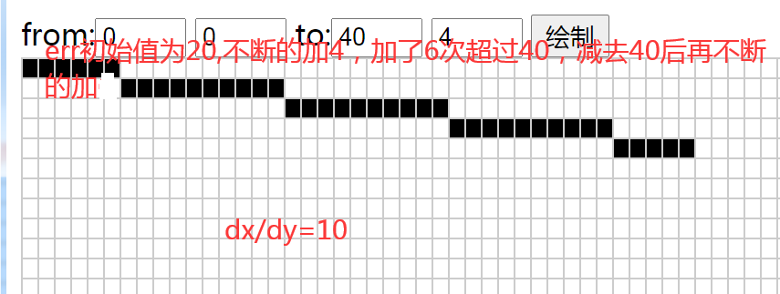

# ZLG_GUI
## C#版 ZLG_GUI
https://github.com/minglie/ming_zlg_gui/tree/master/ming_cs_zlggui

## C51版 ZLG_GUI
https://github.com/minglie/ming_zlg_gui/tree/master/ming_51_zlggui

## ZLG_GUI手册以及相关软件
https://github.com/minglie/ming_zlg_gui/tree/master/doc/

## png转单色bmp脚本
https://github.com/minglie/ming_zlg_gui/tree/master/doc/badapple

# 直线算法
参考的播客
https://blog.csdn.net/cjw_soledad/article/details/78886117

不过文中的解释不太好,正确的理解应为,每一小段有连续(dx/dy)个横格,这一小段横格,横轴长度为dx/dy,纵轴长度为1(最上与最下之差),这一
小段矩形对角线横纵比值是dx/dy,每一小段横纵比是dx/dy,那么直线整体横纵比自然也是(dx/dy),
err的初始值取err = (dx>dy ? dx : -dy)/2 只是为了中庸一些,取0也是可以的

## 直线算法测试
https://github.com/minglie/ming_zlg_gui/tree/master/doc/jstest

``` js
function line1( x0,  y0,  x1,  y1) {
    let dx =Math.abs(x1-x0);
    let sx = x0<x1 ? 1 : -1;
    let dy = Math.abs(y1-y0);
    let sy = y0<y1 ? 1 : -1; 
    let err = (dx>dy ? dx : -dy)/2
    let e2;
    console.log("dx="+dx,"dy="+dy);
    while(1){
      console.log(x0,y0,err,e2);
      if (x0==x1 && y0==y1) break;
      e2 = err;
      if (e2 >-dx) { err -= dy; x0 += sx; console.log("A")}
      if (e2 < dy) { err += dx; y0 += sy;  console.log("B")}
    }
  }
```
## 直线场景1
dx/dy=10,err初始值为20


## 直线场景2
dx/dy=3.07,err初始值为20


## 直线场景3
dx/dy=1,err初始值为20
